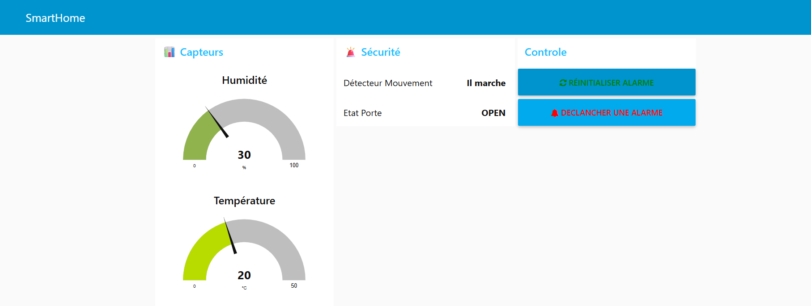

# 🏠 SmartHome IoT - Node-RED + MQTT

Système de monitoring SmartHome en temps réel utilisant Node-RED, MQTT (Mosquitto) et un iPhone comme capteur IoT.


## 📋 Description

Ce projet implémente un système SmartHome complet permettant de :
- Monitorer la température et l'humidité en temps réel
- Détecter les mouvements et l'état des portes
- Déclencher des alarmes automatiques
- Visualiser les données sur un dashboard web professionnel
- Contrôler le système depuis un smartphone

## 🏗️ Architecture
```
┌─────────────────────────────────────────────┐
│            ARCHITECTURE SYSTÈME              │
└─────────────────────────────────────────────┘

📱 iPhone (IoT MQTT Panel)
    ↓ MQTT Publish
💾 Broker MQTT (Mosquitto - VM1)
    ↓ MQTT Subscribe
🎨 Node-RED (VM1)
    ↓ Traitement & Visualisation
📊 Dashboard Web (Port 1880/ui)
```

## 🛠️ Technologies Utilisées

- **MQTT** : Protocole de messagerie IoT
- **Mosquitto** : Broker MQTT open-source
- **Node-RED** : Plateforme de développement visuel
- **node-red-dashboard** : Interface utilisateur web
- **IoT MQTT Panel** : Application mobile iOS

## 📊 Fonctionnalités

### Capteurs Implémentés
- 🌡️ **Température** : Monitoring avec jauge (0-50°C)
- 💧 **Humidité** : Jauge d'humidité (0-100%)
- 🚶 **Détecteur de mouvement** : État ON/OFF
- 🚪 **Capteur de porte** : État OPEN/CLOSED

### Dashboard
- 📈 Graphique historique température (temps réel)
- ⚠️ Système d'alerte (température > 28°C)
- 🔔 Alarme bidirectionnelle (Dashboard → iPhone)
- 🔄 Réinitialisation à distance

## 📦 Installation

### Prérequis
- Ubuntu Server (ou VM)
- Node.js 18+
- Mosquitto MQTT Broker

### 1. Installer Mosquitto
```bash
sudo apt update
sudo apt install mosquitto mosquitto-clients -y
```

### 2. Configurer Mosquitto
```bash
sudo nano /etc/mosquitto/conf.d/default.conf
```

Ajouter :
```
listener 1883 0.0.0.0
allow_anonymous true
```

Redémarrer :
```bash
sudo systemctl restart mosquitto
sudo systemctl enable mosquitto
```

### 3. Installer Node-RED
```bash
bash <(curl -sL https://raw.githubusercontent.com/node-red/linux-installers/master/deb/update-nodejs-and-nodered)
```

### 4. Installer node-red-dashboard
```bash
cd ~/.node-red
npm install node-red-dashboard
```

### 5. Importer le flow

1. Démarrer Node-RED : `node-red`
2. Ouvrir : `http://localhost:1880`
3. Menu ☰ → Import
4. Copier le contenu de `nodered_flow.json`
5. Import
6. Deploy 🚀

### 6. Configurer le firewall
```bash
sudo firewall-cmd --permanent --add-port=1883/tcp
sudo firewall-cmd --permanent --add-port=1880/tcp
sudo firewall-cmd --reload
```

## 📱 Configuration iPhone

### Installer IoT MQTT Panel
- App Store → IoT MQTT Panel

### Créer les Publishers

**Température** :
```
Type: Text Input
Topic: smarthome/temperature
QoS: 1
```

**Humidité** :
```
Type: Text Input
Topic: smarthome/humidity
QoS: 1
```

**Mouvement** :
```
Type: Switch
Topic: smarthome/motion
Payload ON: ON
Payload OFF: OFF
QoS: 1
```

**Porte** :
```
Type: Switch
Topic: smarthome/door
Payload ON: OPEN
Payload OFF: CLOSED
QoS: 1
```

### Créer le Subscriber (Alarme)
```
Type: Text Output
Topic: smarthome/alarm
QoS: 1
```

## 🚀 Utilisation

### Démarrer le système
```bash
# Démarrer Node-RED
node-red

# Vérifier Mosquitto
sudo systemctl status mosquitto
```

### Accéder au Dashboard
```
http://localhost:1880/ui
```

Ou depuis une autre machine :
```
http://IP_VM:1880/ui
```

## 📊 Topics MQTT

| Topic | Description | Type | Format |
|-------|-------------|------|--------|
| `smarthome/temperature` | Température | Publish | Nombre (ex: "25") |
| `smarthome/humidity` | Humidité | Publish | Nombre (ex: "60") |
| `smarthome/motion` | Mouvement | Publish | "ON" / "OFF" |
| `smarthome/door` | Porte | Publish | "OPEN" / "CLOSED" |
| `smarthome/alarm` | Alarme | Subscribe | Message texte |

## 🧪 Tests

### Test MQTT en ligne de commande

**Subscribe** :
```bash
mosquitto_sub -h localhost -t "smarthome/#" -v
```

**Publish** :
```bash
mosquitto_pub -h localhost -t "smarthome/temperature" -m "25"
```

## 📸 Screenshots

### Dashboard


### Flow Node-RED


### Configuration iPhone


## 🐛 Troubleshooting

### Mosquitto ne démarre pas
```bash
sudo systemctl status mosquitto
sudo journalctl -u mosquitto -n 50
```

### Node-RED ne se connecte pas au broker
- Vérifier que Mosquitto tourne : `sudo systemctl status mosquitto`
- Vérifier le port : `sudo ss -tulnp | grep 1883`
- Vérifier la config MQTT dans Node-RED : `localhost:1883`

### Dashboard vide
- Vérifier que les nodes dashboard ont un Group configuré
- Déployer le flow : bouton "Deploy"
- Rafraîchir le navigateur : F5

## 📚 Documentation

- [MQTT Protocol](https://mqtt.org)
- [Mosquitto Documentation](https://mosquitto.org/documentation/)
- [Node-RED Documentation](https://nodered.org/docs/)
- [node-red-dashboard](https://flows.nodered.org/node/node-red-dashboard)

## 🤝 Contribution

Les contributions sont les bienvenues ! N'hésitez pas à :
1. Fork le projet
2. Créer une branche (`git checkout -b feature/amelioration`)
3. Commit vos changements (`git commit -m 'Ajout fonctionnalité'`)
4. Push (`git push origin feature/amelioration`)
5. Ouvrir une Pull Request

## 📝 License

Ce projet est sous licence MIT. Voir le fichier `LICENSE` pour plus de détails.

## 👤 Auteur

**Emmanuel**
- École : ENSI
- Spécialisation : Cybersécurité
- Année : 5ème année
- Projet : TP IoT - Janvier 2026

## 🙏 Remerciements

- Prof d'IoT pour le sujet du TP
- Communauté Node-RED
- Documentation Mosquitto

---

⭐ Si ce projet vous a aidé, n'hésitez pas à mettre une étoile !